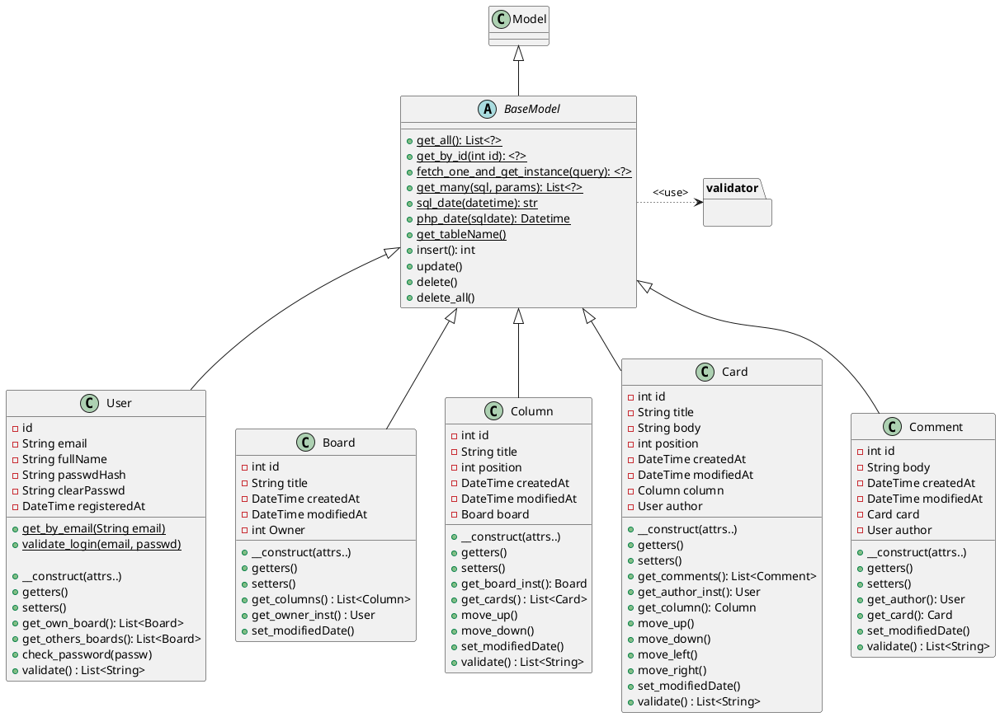
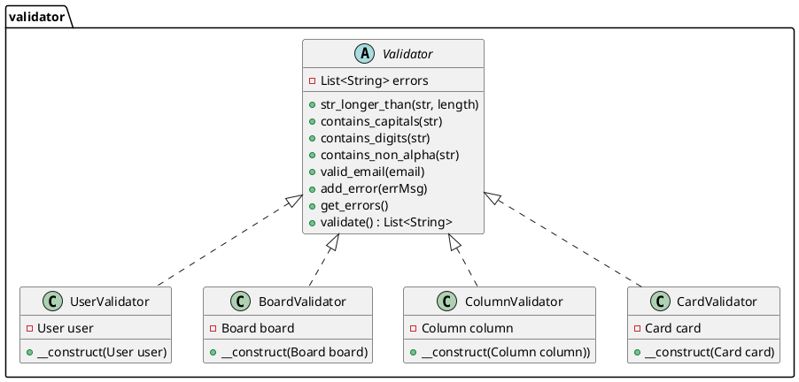
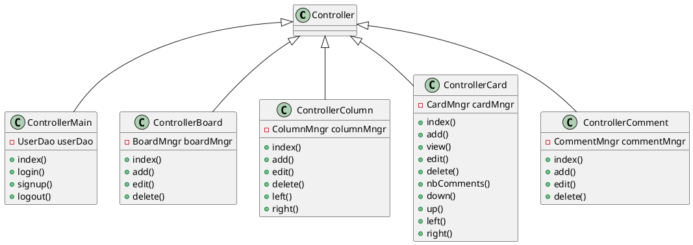

# Diagrammes de classe (V1)
Manière "comme au cours", où les classes représentant les objets de base sont chargées
des requêtes en db.

## Classes de Base et managers
Les managers sont chargés de toutes les opération sur les instances d'objets de base, à part les accès en db

## Validation

# Contrôleurs

