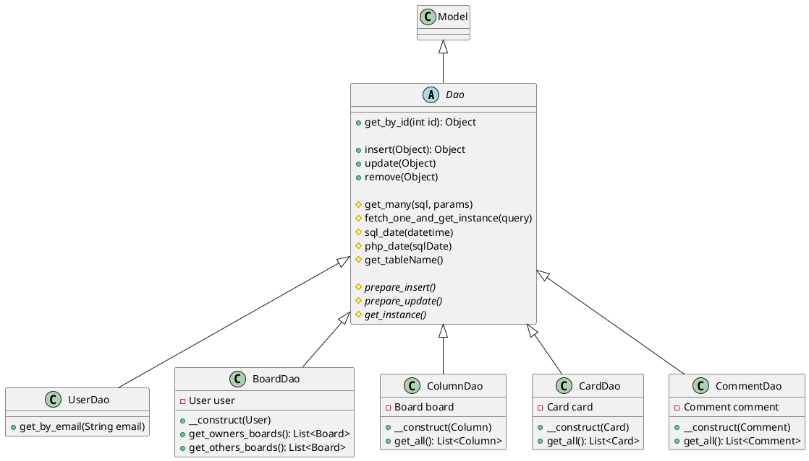
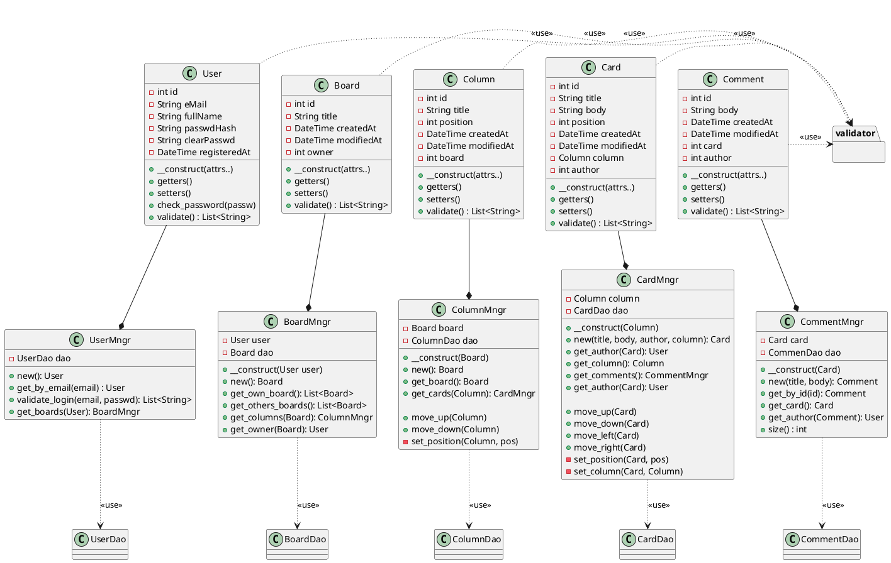
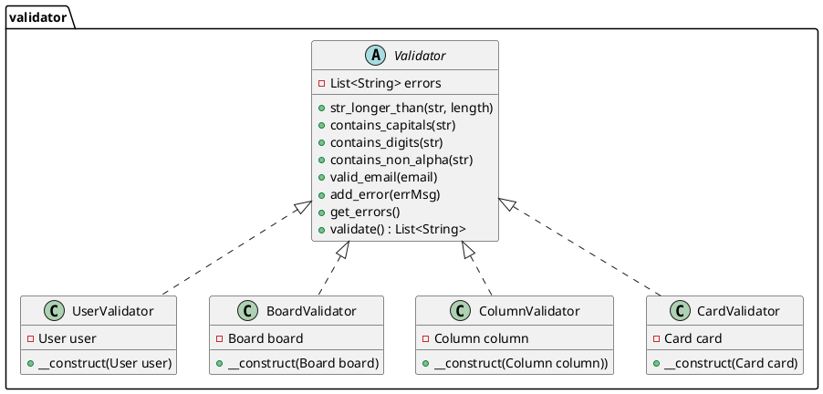
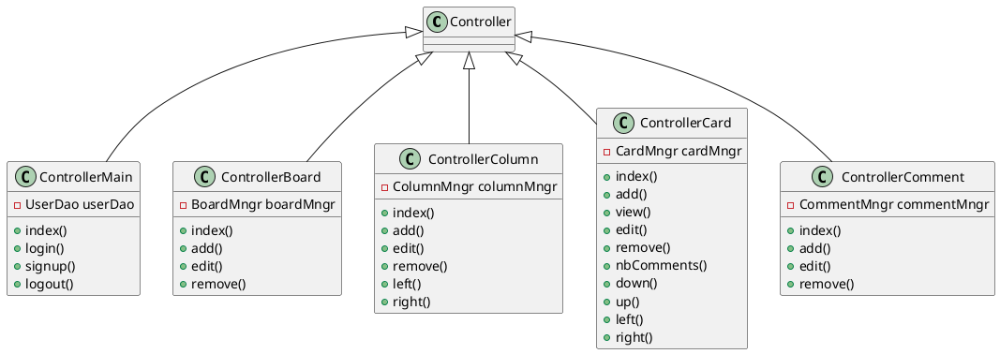

# Diagrammes de classe (V2)
Version avec DAO. On sort toutes les opérations
d'accès à la db des classes représentant les objets de base.

On a une classe basique par objet, qui contient essentiellement les attributs
de l'objet en DB et des getters et setters (User, Board, etc).

On a une classe Dao (pour "data access object") qui est chargé de faire
les requêtes et update de la DB.

Par exemple pour insérer un user depuis le dao on ferait: `UserDao.add(user)`.
Pour ajouter un Board par exemple, on ferait dans le contrôleur approprié:
```
$board = new Board("Un Tableau");
$boardDao = new BoardDao($user);
$boardDao->add($board)
```

À l'instanciation d'un classe Manager on instancie le DAO correspondant

Tout ça a l'avantage de ne pas mélanger les responsabilités, et surtout d'éviter que
les objets de base (ceux qui sont stockés en DB) ne deviennent des sortes de fourre-tout.

## Dao
Les Dao héritent de la  classe abstraite Dao qui elle-même hérite de Model



## Les objets de base et les managers



## Validation



# Contrôleurs
