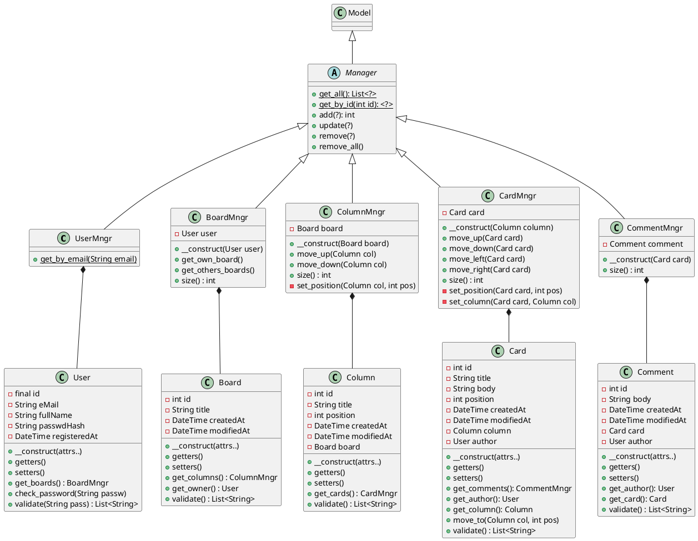
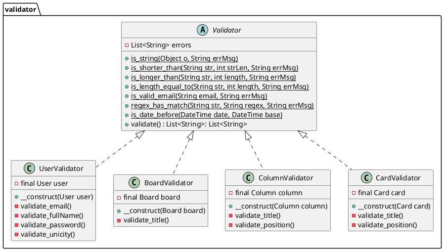
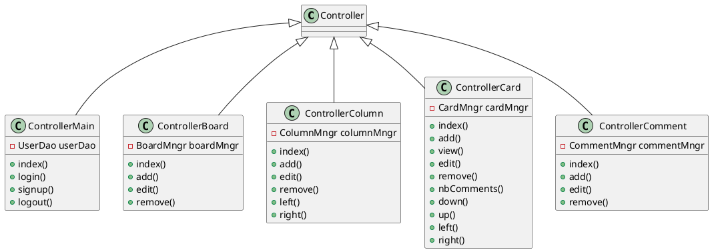

# Diagrammes de classe
Version avec DAO et managers confondus.

## Managers et classes de base

```plantuml
@startuml

UserMngr *-d- User
BoardMngr *-d- Board
ColumnMngr *-d- Column
CardMngr *-d- Card
CommentMngr *-d- Comment

abstract class Manager extends Model {
    + {static} get_all(): List<?>
    + {static} get_by_id(int id): <?>
    + add(?): int
    + update(?)
    + remove(?)
    + remove_all()
}

class UserMngr extends Manager {
    + {static} get_by_email(String email) 
}

class BoardMngr extends Manager {
        - User user
    + __construct(User user)
    + get_own_board()
    + get_others_boards()
    + size() : int
}

class ColumnMngr extends Manager {
    - Board board
    + __construct(Board board)
    + move_up(Column col)
    + move_down(Column col)
    + size() : int
    - set_position(Column col, int pos)
}

class CardMngr extends Manager {
    - Card card
    + __construct(Column column)
    + move_up(Card card)
    + move_down(Card card)
    + move_left(Card card)
    + move_right(Card card)
    + size() : int
    - set_position(Card card, int pos)
    - set_column(Card card, Column col)
}

class CommentMngr extends Manager {
    - Comment comment
    + __construct(Card card)
    + size() : int
}

class User {
    - final id
    - String eMail
    - String fullName
    - String passwdHash
    - DateTime registeredAt
    
    + __construct(attrs..)
    + getters()
    + setters()
    + get_boards() : BoardMngr
    + check_password(String passw)
    + validate(String pass) : List<String>
}

class Board {
    - int id
    - String title
    - DateTime createdAt
    - DateTime modifiedAt
    
    + __construct(attrs..)
    + getters()
    + setters()
    + get_columns() : ColumnMngr
    + get_owner() : User
    + validate() : List<String>
}

class Column {
    - int id
    - String title
    - int position
    - DateTime createdAt
    - DateTime modifiedAt
    - Board board
    + __construct(attrs..)
    + getters()
    + setters()
    + get_cards() : CardMngr
    + validate() : List<String>
}

class Card {
    - int id
    - String title
    - String body
    - int position
    - DateTime createdAt
    - DateTime modifiedAt
    - Column column
    - User author
    
    + __construct(attrs..)
    + getters()
    + setters()
    + get_comments(): CommentMngr
    + get_author(): User
    + get_column(): Column
    + move_to(Column col, int pos)
    + validate() : List<String>
}

class Comment {
    - int id
    - String body
    - DateTime createdAt
    - DateTime modifiedAt
    - Card card
    - User author

    + __construct(attrs..)
    + getters()
    + setters()
    + get_author(): User
    + get_card(): Card
    + validate() : List<String>
}

@enduml
```

## Validation

```plantuml
@startuml
package validator {
abstract class Validator {
    - List<String> errors
    + {static} is_string(Object o, String errMsg)
    + {static} is_shorter_than(String str, int strLen, String errMsg)
    + {static} is_longer_than(String str, int length, String errMsg)
    + {static} is_length_equal_to(String str, int length, String errMsg)
    + {static} is_valid_email(String email, String errMsg)
    + {static} regex_has_match(String str, String regex, String errMsg)
    + {static} is_date_before(DateTime date, DateTime base)
    + validate() : List<String>: List<String>
}

class UserValidator implements Validator {
    - final User user
    + __construct(User user)
    - validate_email()
    - validate_fullName()
    - validate_password()
    - validate_unicity()
}

class BoardValidator implements Validator {
    - final Board board
    + __construct(Board board)
    - validate_title()
}

class ColumnValidator implements Validator {
    - final Column column
    + __construct(Column column)
    - validate_title()
    - validate_position()
}

class CardValidator implements Validator {
    - final Card card
    + __construct(Card card)
    - validate_title()
    - validate_position()
}
}
@enduml
```

# Contrôleurs

```plantuml
@startuml
Controller <|-- ControllerMain
Controller <|-- ControllerBoard
Controller <|-- ControllerColumn
Controller <|-- ControllerCard
Controller <|-- ControllerComment

class ControllerMain {
    - UserDao userDao
    + index()
    + login()
    + signup()
    + logout()
}

class ControllerBoard {
    - BoardMngr boardMngr
    + index()
    + add()
    + edit()
    + remove()
}

class ControllerColumn {
    - ColumnMngr columnMngr
    + index()
    + add()
    + edit()
    + remove()
    + left()
    + right()
}

class ControllerCard {
    - CardMngr cardMngr
    + index()
    + add()
    + view()
    + edit()
    + remove()
    + nbComments()
    + down()
    + up()
    + left()
    + right()
}

class ControllerComment {
    - CommentMngr commentMngr
    + index()
    + add()
    + edit()
    + remove()
}

@enduml
```