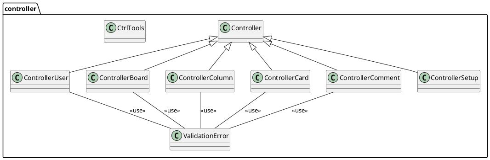
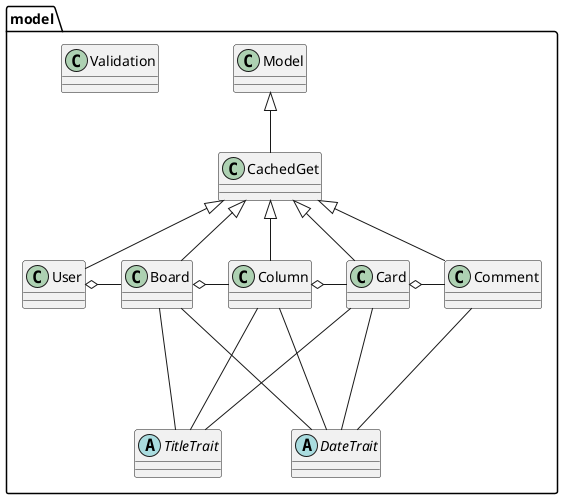
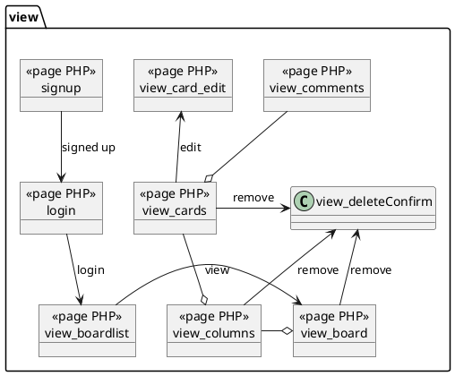

# Diagrammes de classe

## Contrôleur

```plantuml
@startuml

package controller {

ControllerUser -- ValidationError: <<use>>
ControllerBoard -- ValidationError: <<use>>
ControllerColumn -- ValidationError: <<use>>
ControllerCard -- ValidationError: <<use>>
ControllerComment -- ValidationError: <<use>>

class ControllerUser extends Controller
class ControllerBoard extends Controller
class ControllerColumn extends Controller
class ControllerCard extends Controller
class ControllerComment extends Controller
class ControllerSetup extends Controller
class ValidationError
class CtrlTools
}
@enduml
```

## Modèle

```plantuml
@startuml
package model {
class Model
class CachedGet extends Model

abstract class DateTrait
abstract TitleTrait

class Validation

class User extends CachedGet
class Board extends CachedGet
class Column extends CachedGet
class Card extends CachedGet
class Comment extends CachedGet


User o- Board
Board o- Column
Column o- Card
Card o- Comment

Board --- DateTrait
Column --- DateTrait
Card --- DateTrait
Comment --- DateTrait

Board --- TitleTrait
Column --- TitleTrait
Card -- TitleTrait
User --[hidden] TitleTrait

}

@enduml
```

## Vues

```plantuml
@startuml
package view {

object "<<page PHP>>\nview_boardlist" as view_boardlist
object "<<page PHP>>\nview_card_edit" as view_card_edit
object "<<page PHP>>\nlogin" as login
object "<<page PHP>>\nsignup" as signup

object "<<page PHP>>\nview_board" as view_board
object "<<page PHP>>\nview_columns" as view_columns
object "<<page PHP>>\nview_cards" as view_cards
object "<<page PHP>>\nview_comments" as view_comments

view_boardlist -right> view_board: view
view_board -left-> view_deleteConfirm: remove
view_columns -right--o view_board
view_columns -left-> view_deleteConfirm: remove
view_cards --o view_columns
view_cards -up-> view_card_edit: edit
view_cards -left-> view_deleteConfirm: remove
view_comments --o view_cards

login --> view_boardlist: login
signup --> login: signed up


}

@enduml
```