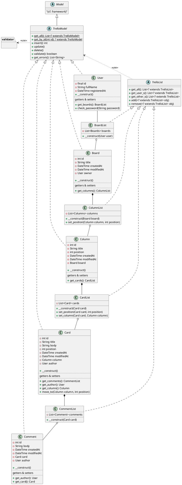
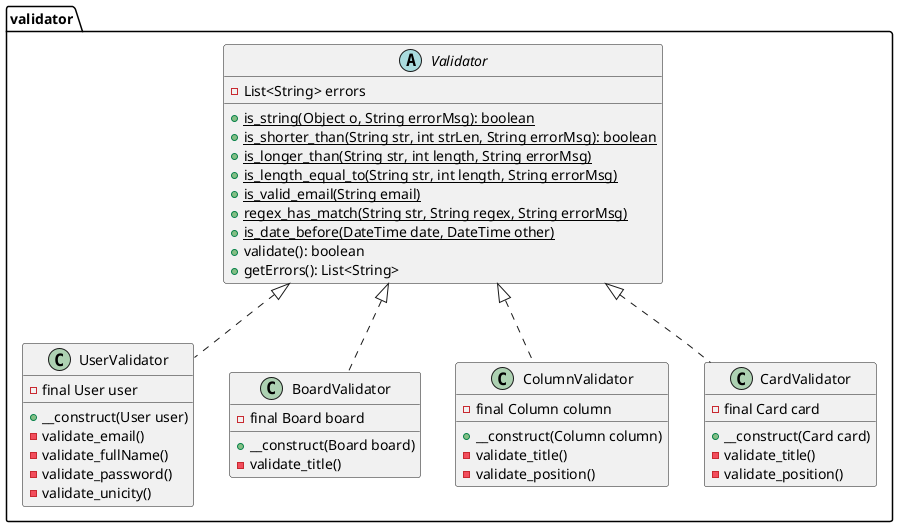

# Diagrammes de classe

```plantuml
@startuml

TrelloModel -[dotted]l-> validator: <<use>>
TrelloList -[dotted]l-> TrelloModel: <<use>>

User -- BoardList
Board *-- ColumnList
Column *-- CardList
Card *-- CommentList

BoardList o-- Board
ColumnList o-- Column
CardList o-- Card
CommentList o-- Comment

package validator {
}

abstract class Model {
    "(cf. framework)"
}

abstract class TrelloModel extends Model {
    + {static} get_all(): List<? extends TrelloModel>
    + {static} get_by_id(int id): ? extends TrelloModel
    + insert(): int
    + update()
    + delete()
    + validate(): boolean
    + get_errors(): List<String>
}

class User implements TrelloModel {
    - final id
    - String fullName
    - DateTime registeredAt
    + __construct()
    ..
    getters & setters
    ..
    + get_boards(): BoardList
    + check_password(String password)
}

class Board implements TrelloModel {
    - int id
    - String title
    - DateTime createdAt
    - DateTime modifiedAt
    - User owner

    + __construct()
    ..
    getters & setters
    ..
    + get_columns(): ColumnList
}

class Column implements TrelloModel {
    - int id
    - String title
    - int position
    - DateTime createdAt
    - DateTime modifiedAt
    - Board board

    + __construct()
    ..
    getters & setters
    ..
    + get_cards(): CardList
}

class Card implements TrelloModel {
    - int id
    - String title
    - String body
    - int position
    - DateTime createdAt
    - DateTime modifiedAt
    - Column column
    - User author
    
    + __construct()
    ..
    getters & setters
    ..
    + get_comments(): CommentList
    + get_author(): User
    + get_column(): Column
    + move_to(Column column, int position)
}

class Comment implements TrelloModel {
    - int id
    - String body
    - DateTime createdAt
    - DateTime modifiedAt
    - Card card
    - User author

    + __construct()
    ..
    getters & setters
    ..
    + get_author(): User
    + get_card(): Card
}

abstract class TrelloList {
    + get_all(): List<? extends TrelloList>
    + get_user_s(): List<? extends TrelloList>
    + get_other_s(): List<? extends TrelloList> 
    + add(<? extends TrelloList> obj)
    + remove(<? extends TrelloList> obj)
}

class BoardList implements TrelloList {
    - List<Boards> boards
    + __construct(User user)
}

class ColumnList implements TrelloList {
    - List<Columns> columns
    + __construct(Board board)
    + set_position(Column column, int position)
}

class CardList implements TrelloList {
    - List<Card> cards
    + __construct(Card card)
    + set_position(Card card, int position)
    + set_column(Card card, Column column)
}

class CommentList implements TrelloList {
    - List<Comment> comments
    + __construct(Card card)
}

@enduml
```

## Validator

```plantuml
@startuml
package validator {
abstract class Validator {
    - List<String> errors
    + {static} is_string(Object o, String errorMsg): boolean
    + {static} is_shorter_than(String str, int strLen, String errorMsg): boolean
    + {static} is_longer_than(String str, int length, String errorMsg)
    + {static} is_length_equal_to(String str, int length, String errorMsg)
    + {static} is_valid_email(String email)
    + {static} regex_has_match(String str, String regex, String errorMsg)
    + {static} is_date_before(DateTime date, DateTime other)
    + validate(): boolean
    + getErrors(): List<String>
}

class UserValidator implements Validator {
    - final User user
    + __construct(User user)
    - validate_email()
    - validate_fullName()
    - validate_password()
    - validate_unicity()
}

class BoardValidator implements Validator {
    - final Board board
    + __construct(Board board)
    - validate_title()
}

class ColumnValidator implements Validator {
    - final Column column
    + __construct(Column column)
    - validate_title()
    - validate_position()
}

class CardValidator implements Validator {
    - final Card card
    + __construct(Card card)
    - validate_title()
    - validate_position()
}
}
@enduml
```